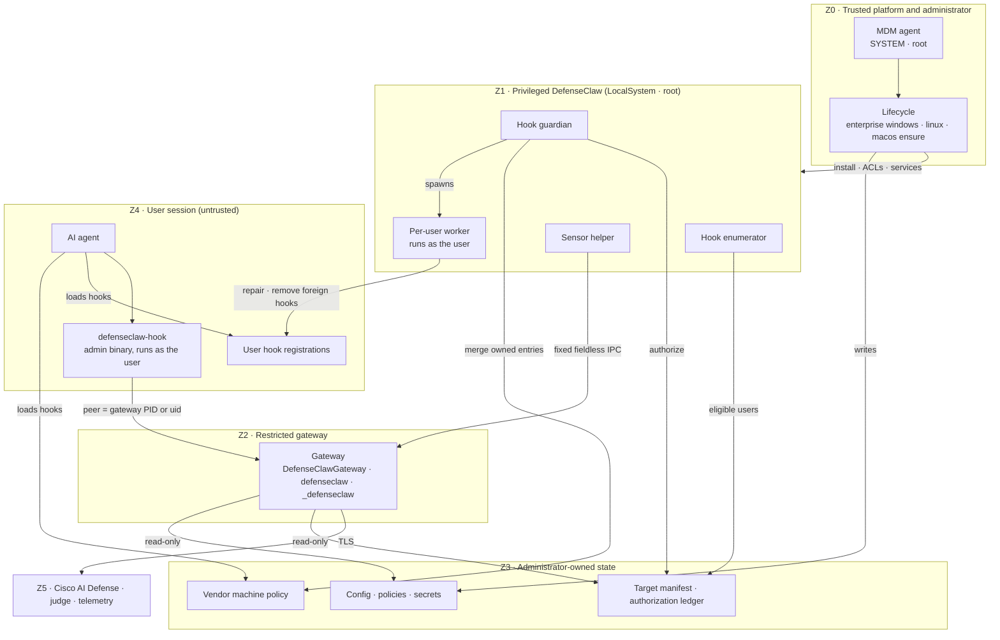

# Enterprise threat model (Windows, Linux, macOS)

This is the cross-platform threat model for DefenseClaw's `managed_enterprise`
deployment mode. It explains which DefenseClaw component runs in which
privilege zone on each operating system, how every boundary between zones is
protected, and which risks remain. The per-platform models carry the detailed
threat rows:

- [Windows](WINDOWS-ENTERPRISE-THREAT-MODEL.md) — rows `W-01`…
- [Linux](LINUX-ENTERPRISE-THREAT-MODEL.md) — rows `L-01`…
- [macOS](MACOS-ENTERPRISE-THREAT-MODEL.md) — rows `M-01`…

The design comes from `internal/managed/profile.go`,
`internal/managed/standalone_layout.go`, and `internal/config/enterprise.go`.
Sections that describe work still being merged into the enterprise-hardening
branch carry a `verify-after-merge` comment naming the milestone. Treat those
sections as the intended design until the comment is removed after the code
and its certification evidence land. A certification record must name the
exact tree hash it tested; this document does not pin one.

## Scope

In scope:

- the `managed_enterprise` services, lifecycle commands, protected state,
  per-user hook enrollment and repair, vendor machine policy, and the hook
  runtime on Windows, Linux and macOS;
- both enterprise profiles (below);
- a standard local user, an AI agent running as that user, a prompt that
  steers that agent, another local user, and a compromised gateway process.

Out of scope, as in every platform model:

- a fully elevated administrator, root, LocalSystem, the MDM authority, a
  malicious signer, or a kernel compromise;
- physical access and offline disk modification without full-disk
  encryption;
- prevention of every local resource-exhaustion attack (availability is
  covered as a residual).

## Profiles

`managed_enterprise` runs in one of two profiles. The profile is set by
`enterprise.profile` in the administrator-owned config and pinned by
`DEFENSECLAW_ENTERPRISE_PROFILE` in every service environment. The pin and
the config must agree or the service refuses to start
(`managed.ResolveEnterpriseProfile`). The profile cannot change during a hot
reload (`internal/gateway/config_manager.go`, `enterprise_profile_change`).

| | `secure_client` | `standalone` |
| --- | --- | --- |
| Who installs it | Cisco Secure Client, as a module (Windows, macOS) | Any MDM, a package manager, or an administrator shell (Windows, Linux, macOS) |
| Default when unset | Windows, macOS | Linux (Linux rejects `secure_client`) |
| Decisions | Cisco AI Defense only, authenticated with the Secure Client Cloud Management identity; local detectors off | Local policy engine (rule packs, policy, CodeGuard, judge when keyed), plus Cisco AI Defense when an administrator stores an API key in a protected credential |
| When AI Defense is unreachable | Governed by the Secure Client posture | The local verdict stands |
| Windows services | Gateway, CMID broker, sensor helper, guardian, enumerator (five) | Gateway, sensor helper, guardian, enumerator (four; no broker) |
| Linux units | — | Gateway with activated API and hook sockets, guardian, enumerator, sensor helper, config-apply path unit, daily verify timer |
| macOS daemons | Gateway, guardian, enumerator, all as root (`com.cisco.secureclient.defenseclaw.*`) | Gateway as the hidden `_defenseclaw` user; guardian, enumerator and sensor helper as root (`com.cisco.defenseclaw.*`) |
| Roots | `…\Cisco\Cisco Secure Client\DefenseClaw`, `/opt/cisco/secureclient/defenseclaw` | Windows `C:\Program Files\Cisco\DefenseClaw` + `C:\ProgramData\Cisco\DefenseClaw`; Linux `/opt/defenseclaw`, `/etc/defenseclaw`, `/var/lib/defenseclaw`; macOS `/opt/cisco/defenseclaw` + `/Library/Logs/Cisco/DefenseClaw` |
| Secure Client GUI IPC, `env_config.json`, managed telemetry sink | On | Off |
| Lifecycle engine | Windows PowerShell 5.1 (Windows), `packaging/macos/install.sh` (macOS) | PowerShell 7 (Windows), Go (`internal/enterpriseunix`, Linux and macOS) |

The `secure_client` profile is in production. Nothing in the standalone work
changes it: every standalone behavior is gated on the resolved profile, and a
golden suite (`testdata/secure_client_golden/`, `*_golden_test.go`,
`packaging/windows/tests/secure-client-golden.ps1`) byte-compares its rendered
config, service definitions, ACL plan, vendor policy bytes and status output
after every change. The profiles cannot coexist on one host: they share
service names, and each lifecycle refuses to install over the other
(`profile_conflict`).

The rest of this document describes the standalone profile unless a row says
otherwise. The Secure Client profile's controls are described in the Windows
model and in the Secure Client packaging documentation.

## Trust zones

Every DefenseClaw component belongs to exactly one zone. An arrow that
crosses a zone boundary is an attack surface and is listed in
[Boundaries](#boundaries).

| Zone | Windows | Linux | macOS | Protected by |
| --- | --- | --- | --- | --- |
| Z0 Trusted platform and administrator | SCM, LSA, Administrators, the MDM agent running as SYSTEM (for example the Intune Management Extension), Setup `/ensure` or `defenseclaw.exe enterprise windows` (the installed enterprise CLI) | PID 1 (systemd), root, the package manager, `defenseclaw-gateway enterprise linux` | launchd, root, the MDM agent, the package's postinstall, `defenseclaw-gateway enterprise macos` | Trusted by assumption. Artifacts are verified before use: Authenticode or a hash-pinned payload manifest on Windows; package signatures and published checksums on Linux and macOS |
| Z1 Privileged DefenseClaw services | Hook guardian and enumerator (LocalSystem, explicit privilege list); sensor helper (LocalSystem, `SeChangeNotifyPrivilege` only) | Guardian (root, bounded capabilities); enumerator (root, read-only homes); sensor helper (root, acquisition capabilities) | Guardian, enumerator, sensor helper (root) | Users get query-only SCM access; units and plists are root-owned; user homes are written only through a per-user worker running as that user (Linux, macOS) or an impersonated token (Windows) |
| Z2 Restricted gateway | `NT SERVICE\DefenseClawGateway`, restricted service SID | `defenseclaw` system user, empty capability set, systemd sandbox | `_defenseclaw` hidden user | Config, policy, secrets directory and authorization ledger are read-only to it; it writes only its runtime state and logs |
| Z3 Administrator-owned state | Program Files binaries; ProgramData config, policies, secrets, target manifest, ledger; vendor machine policy | `/opt/defenseclaw`, `/etc/defenseclaw`, `/var/lib/defenseclaw-hook-guardian`, `/etc/{codex,claude-code,cursor,github-copilot,opencode}` | `/opt/cisco/defenseclaw`, `/Library/Application Support/{ClaudeCode,Cursor,opencode}`, `/etc/{codex,github-copilot}` | Only administrators write. Users may read policy and the public machine-policy summary, never secrets or other users' tokens |
| Z4 User session (untrusted) | The AI agent and `defenseclaw-hook.exe` (an administrator-owned binary running as the user); per-user registrations | The AI agent and `/opt/defenseclaw/bin/defenseclaw-hook` | The AI agent and `/opt/cisco/defenseclaw/bin/defenseclaw-hook` | The hook sends nothing until the listener is the exact gateway; the foreign-hook guard; guardian repair |
| Z5 External | Cisco AI Defense, LLM judge, telemetry, the MDM cloud, vendor server-managed policy | same | same | TLS, outbound from the gateway only |

<!-- verify-after-merge: M2 M4 M6 — service identities, units, plists and the Windows standalone service set -->

## Boundaries

Each row is one arrow that crosses a zone boundary: what could go wrong, the
mechanism that protects it, and where the evidence lives.

| # | Crossing | Threat | Mechanism | Evidence |
| --- | --- | --- | --- | --- |
| B1 | Z0 → Z1/Z3: lifecycle installs services and state | A user-writable payload, config or engine is executed or installed with administrator rights | Windows: the standalone CLI resolves PowerShell 7 only from its HKLM registration, requires a Microsoft Authenticode signature and an administrator-owned path, scrubs .NET and PowerShell loader variables, and verifies a hash-pinned installer before launching it. Linux and macOS: paths come only from `managed.StandaloneLayoutFor`; every mutating action is a locked transaction with snapshot and rollback | `internal/cli/windows_enterprise_pwsh.go`, `internal/cli/windows_enterprise_profile.go`, `internal/enterpriseunix/lifecycle.go`, `internal/enterpriseunix/lock.go` <!-- verify-after-merge: M2 M6 --> |
| B2 | Z4 → Z0: a user runs `install.sh`, `install.ps1`, `defenseclaw upgrade` or a per-user gateway on a managed host | A per-user install takes the shared port or state directory and blocks or shadows managed hooks | Per-user installers and `defenseclaw-gateway start` refuse on a managed host (the Windows marker key `HKLM\SOFTWARE\Cisco\DefenseClaw\Enterprise`, the Linux and macOS runtime descriptor); `coexistence.per_user_install: migrate` removes only DefenseClaw-owned per-user registrations | `internal/cli/managed_host_guard.go`, `scripts/install.sh`, `scripts/install.ps1`, `internal/cli/windows_enterprise_registration.go` <!-- verify-after-merge: M2 M6 --> |
| B3 | Z4 → Z1: a user controls a service | Stop, disable, mask, reconfigure, delete or replace a service or its binary | Windows service DACLs grant users query only; units, plists and binaries are root- or Administrators-owned; `Restart=always` with `StartLimitIntervalSec=0`, launchd `KeepAlive`, SCM recovery repeated indefinitely | `packaging/systemd/*.service`, `packaging/launchd-standalone/*.plist`, Windows rows W-01, W-20, W-21 |
| B4 | Z4 → Z3: a user edits administrator state | Config, policy, secrets, manifest, ledger, descriptor or machine policy is changed | Administrator-only write on every file and ancestor; the loader rejects untrusted config and policy inputs (`validateManagedStandalonePolicyInputs`); secrets are root-only or DACL-exact; the descriptor is parsed strictly from a trusted path | `internal/config/enterprise.go`, `internal/managed/credentials_unix.go`, `internal/managed/credentials_windows.go`, `internal/managed/runtime_descriptor.go` |
| B5 | Z2 → Z3: a compromised gateway edits policy or authorization | The gateway widens its own policy or forges readiness | Gateway identity is read-only on config, policy and the ledger (`ReadOnlyPaths=`, Windows restricted SID); the ledger is written only by the guardian | `packaging/systemd/defenseclaw-gateway.service`, Windows row W-05 <!-- verify-after-merge: M2 --> |
| B6 | Z2 → Z5: the gateway calls Cisco AI Defense | The API key leaks to a user or into logs | The key is read only from a protected credential (systemd `LoadCredential=` under `/run/credentials/`, else a root-owned single-link file; Windows exact SYSTEM/Administrators/gateway-read DACL); `api_key_env` is cleared; inline `cisco_ai_defense.api_key` is rejected in standalone; values are never printed by `enterprise secret` | `internal/gateway/standalone_inspection.go`, `internal/managed/credentials*.go`, `internal/enterpriseunix/secrets.go` |
| B7 | Z4 → Z2: the hook calls the gateway | A user process binds the gateway endpoint during a restart and returns a forged allow | The hook writes no byte until the peer is proven: Windows compares the connected peer PID with the SCM gateway PID; Linux and macOS prefer the hook socket and require its `SO_PEERCRED` / `LOCAL_PEERCRED` uid to be root or the gateway uid from the root-owned descriptor; Linux TCP fallback resolves the server socket's owner uid for the exact 4-tuple (`NETLINK_SOCK_DIAG`, `/proc/net/tcp`); macOS has no TCP fallback. On Linux, PID 1 holds both sockets across gateway restarts | `internal/gateway/connector/hookexec/managed_standalone_transport.go`, `internal/gateway/connector/hookexec/tcp_owner_linux.go`, `internal/peercred/`, `internal/systemd/activation.go`, `internal/cli/hook_trusted_state_unix.go`; the socket unit `packaging/systemd/defenseclaw-gateway-hook.socket` <!-- verify-after-merge: M2 — socket units --> |
| B8 | Z4 → Z2: the gateway authorizes the hook caller | An unenrolled user or another connector's credential uses a hook route | Hook socket: the gateway reads the caller's kernel uid and checks the guardian's root-owned ledger (per-user connectors require enrollment; machine-policy connectors inspect every user unless `enrollment.unenrolled_users: deny`; `enrollment.root` governs uid 0). TCP: connector-scoped tokens accepted only on that connector's hook and notify routes | `internal/gateway/managed_hook_peer.go`, `internal/gateway/api_uds_unix.go` |
| B9 | Z1 → Z4: the guardian repairs a user's hooks | Root or LocalSystem follows a user-planted link, races a check, or writes outside the home | Windows: every user mutation runs under the exact target token (W-06). Linux and macOS standalone: the root guardian never touches a home in-process; a per-user `apply-target` worker runs with the target's uid and gid in its own session (Linux: parent-death signal, non-dumpable), with rlimits and a timeout. Homes under a world-writable ancestor are refused | `internal/cli/enterprise_hooks_worker_unix.go`, `internal/enterprisehooks/standalone_unix.go`, `internal/enterprisehooks/home_unix.go` <!-- verify-after-merge: M4 --> |
| B10 | Z1 → Z3: the enumerator publishes the manifest | An ineligible identity is enrolled, operator state is overwritten, or a directory outage revokes everyone | Directory-backed accounts resolve through NSS (`getent`) on Linux and Directory Services on macOS; only a definitive not-found counts as absence, and a row is revoked after several consecutive misses; uid or home-inode changes are treated as a new identity; existing `enabled` / `deferred` / version state is preserved | `internal/unixidentity/`, `internal/enterprisehooks/enumerator_unix.go`, Windows row W-42 <!-- verify-after-merge: M4 --> |
| B11 | Z1 → Z3: the guardian merges vendor machine policy | An administrator's own hooks or settings are overwritten or deleted | DefenseClaw writes only its own entries (a `90-defenseclaw.json` drop-in, marked regions in Codex `requirements.toml`), records ownership and preimages, reports conflicts, and never re-marshals an administrator document. `ownership` is `merge`, `verify_only` or `off` per connector | `internal/enterprisepolicy/` <!-- verify-after-merge: M5 --> |
| B12 | Z4 → Z4: a user or project hook rewrites a tool call after DefenseClaw inspected it | Inspection bypass through ordinary file writes | Codex and Claude: vendor locks (`allow_managed_hooks_only`, `allowManagedHooksOnly`) are set by default, and Codex requirements always pin `[features] hooks = true`. Connectors without a lock: the guardian removes foreign entries from user-level config (backed up and audited), and the hook fails closed while an unapproved foreign hook is present in project files, naming the file and the allowlist (`enterprise.machine_policy.connectors.<connector>.allowed_hooks`) | `internal/enterprisepolicy/guard.go`, `internal/cli/hook_foreign_guard.go`, `internal/enterprisepolicy/codex.go`, `internal/enterprisepolicy/claude.go` <!-- verify-after-merge: M5 --> |
| B13 | Z1 → Z2: the sensor helper answers the gateway | A compromised gateway uses the privileged helper to read arbitrary host data | Fixed, fieldless request protocol: no caller-selected path, pid, filter, glob or command; standalone helpers use their own runtime directory and manifest-derived homes | `cmd/defenseclaw-sensor-helper/`, `packaging/systemd/defenseclaw-sensor-helper.service` <!-- verify-after-merge: M2 --> |
| B14 | Z0 → Z3: an MDM or administrator also manages the vendor policy | Two writers flap, or a higher-precedence source shadows DefenseClaw's hooks | `ownership: verify_only` for a file an MDM templates; Claude higher-precedence sources (HKLM, macOS managed preferences, server-managed) are detected and require `managedSourcesBehavior: merge` (Claude Code 2.1.242 or later) or an exported DefenseClaw block (`enterprise policy export`); otherwise `higher_precedence_sources: fail` (default) or `warn` | `internal/enterprisepolicy/claude_sources_*.go`, `internal/enterprisepolicy/export.go` <!-- verify-after-merge: M5 --> |

## Invariants

These hold on every platform in the standalone profile.

1. `managed_enterprise` and the profile are both configuration and authority.
   A user environment variable or user config cannot select, downgrade or
   change either.
2. The gateway never runs as root or LocalSystem.
3. Paths come from the fixed layout, never from the caller's environment.
4. No privileged process mutates a user home with its own credentials. On
   Windows the write happens under the target's token; on Linux and macOS it
   happens in a worker running as the target.
5. A hook sends no request byte to a listener whose identity it has not
   verified with the kernel or SCM.
6. The authorization ledger, not a service-writable status file, decides
   enrollment and readiness.
7. A directory lookup error never revokes a user; only a definitive
   not-found does.
8. DefenseClaw edits only the machine-policy entries it owns, and uninstall
   removes only those entries or restores their recorded preimages.
9. A secret value is never logged, printed, or placed on a command line.
10. `Running` is not readiness. Partial coverage is reported as incomplete.

## Residual risks

| # | Residual | Where | Why it remains | Mitigation outside DefenseClaw |
| --- | --- | --- | --- | --- |
| R1 | Bounded repair window: a user can edit or delete files they own (per-user hook registrations) until the next guardian pass | Per-user connectors on every OS | The files belong to the user by design | Prefer machine-policy connectors; application control or MDM file policy |
| R2 | Claude Code `--bare` and `CLAUDE_CODE_SIMPLE=1` skip managed `SessionStart` and `UserPromptSubmit` hooks; managed `PreToolUse` still runs | Claude Code, every OS | Vendor behavior (`docs/research/ENTERPRISE-MACHINE-POLICY.md`) | Treat prompt inspection as advisory; tool-level inspection is the enforcement point |
| R3 | Amp has no machine plugin path, and plugin handler order is undefined; execute mode can start a turn before plugins load | Amp, every OS | Vendor design | Per-user plugin with guardian repair and the foreign-plugin guard |
| R4 | OpenCode runs the managed plugin after user and project plugins, so it inspects rewritten arguments; the order is observed, not documented | OpenCode | Vendor behavior may change between releases | Re-certify per client release; the foreign-plugin guard |
| R5 | Hermes does not enforce hook exit status or timeouts, so a hook cannot fail closed upstream | Hermes | Vendor design | Treat Hermes coverage as advisory |
| R6 | Copilot command hooks that time out fail open, even policy hooks | GitHub Copilot CLI | Vendor behavior | Keep hook latency bounded; monitor timeouts |
| R7 | A user can deny availability by holding the gateway port or the hook socket name while the gateway is down; a forged allow is still impossible (B7). On Linux, PID 1 holds both sockets, which narrows this to the TCP fallback | Every OS | Port squatting cannot be prevented without the service holding the port continuously | Socket activation (Linux), monitoring, endpoint resource controls |
| R8 | Hash-pinned (unsigned) payloads do not satisfy application-control policies that require a publisher signature | Windows WDAC and AppLocker, macOS Gatekeeper | Signing is optional until a release channel provides it | Authenticode or Developer ID signing, or customer re-signing with pinned signers (`trust.allowed_signers`) |
| R9 | A higher-precedence vendor source (Codex cloud or macOS MDM requirements, Claude server-managed settings) can override local machine policy and is not always visible locally | Codex, Claude Code | Vendor precedence | `enterprise policy verify --live --user <user>` with the real client; coordinate with whoever owns the cloud policy |
| R10 | A compromised privileged DefenseClaw service (guardian, enumerator, sensor helper) holds root or LocalSystem authority | Every OS | Those services need the privilege | Collapses into the trusted-administrator assumption; keep binaries administrator-owned |
| R11 | An administrator or a user with unrestricted sudo can remove DefenseClaw | Every OS | Out of scope by definition | Restrict administrator membership; audit lifecycle events |

<!-- verify-after-merge: M5 — R2–R6 and R9 come from the machine-policy research gate; re-check against the certified client versions -->

## Certification

The platform certification harnesses exercise the rows above on real hosts:

- Windows: `scripts/test-windows-enterprise-hardening.ps1` (PowerShell 7) and
  [WINDOWS-ENTERPRISE-CERTIFICATION.md](WINDOWS-ENTERPRISE-CERTIFICATION.md).
- Linux and macOS: the standalone lifecycle `verify` action and the Unix
  certification harness. <!-- verify-after-merge: M10 -->

Every run records the tree hash, host facts and results. A skipped
destructive probe, a failed cleanup, or an unexplained failure leaves
certification incomplete.
