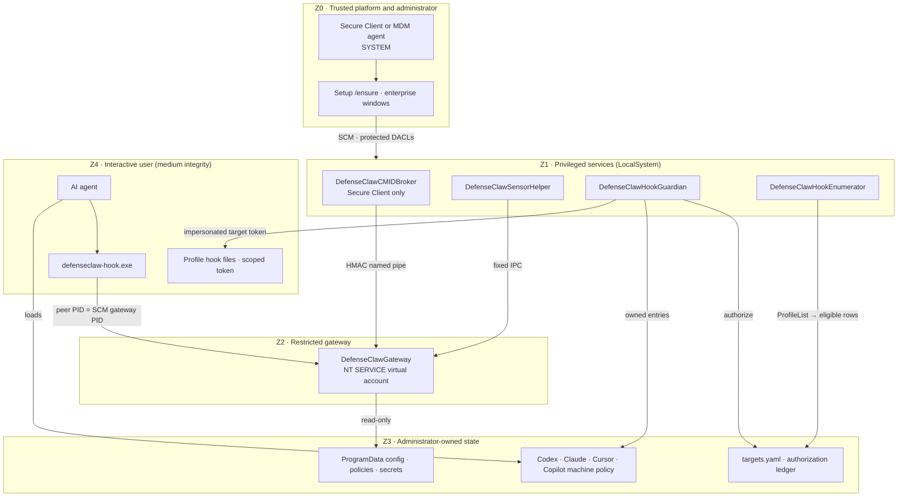

# Windows managed-enterprise threat model

This is the Windows part of the [enterprise threat model](ENTERPRISE-THREAT-MODEL.md).
The cross-platform document defines the two enterprise profiles, the trust
zones Z0–Z5 and the boundary table; this document carries the Windows threat
rows `W-01`…

## Review scope

- Repository: `defenseclaw`
- Review target: the native Windows managed-enterprise services, lifecycle
  commands, protected state, per-user hook reconciliation, vendor machine
  policy, and the certification harness, in both enterprise profiles:
  - `secure_client` — installed by Cisco Secure Client; in production and
    unchanged by the standalone work;
  - `standalone` — installed by any MDM or an administrator, without Secure
    Client.
- A certification record must name the exact tree hash it built and tested.
  This document does not pin a commit.
- Primary paths:
  - `cmd/defenseclaw`
  - `internal/cli`
  - `internal/config`
  - `internal/enterprisehooks`
  - `internal/gateway`
  - `internal/managed`
  - `packaging/windows`
  - `scripts/test-windows-enterprise-hardening.ps1`
- Security boundary: a supported Windows endpoint on a local fixed NTFS volume

Rows `W-01`…`W-42` describe controls shared by both profiles unless a row
names one. Rows `W-43` and later cover the standalone profile. Standalone rows
that describe work still being merged carry a `verify-after-merge` comment.

## Security objectives

The Windows deployment must provide the same security properties as the Linux
and macOS managed-enterprise deployments, expressed in Windows-native terms:

1. A standard local user cannot stop, pause, reconfigure, delete, or replace
   any production SCM service. The Secure Client profile has five:
   `DefenseClawGateway`, `DefenseClawCMIDBroker`, `DefenseClawSensorHelper`,
   `DefenseClawHookGuardian`, and `DefenseClawHookEnumerator`. The standalone
   profile has the same services without `DefenseClawCMIDBroker`.
2. A standard local user cannot change the protected executable, managed
   configuration, mode pin, target manifest, service definition, or guardian
   authorization ledger.
3. The gateway has only the filesystem and token privileges required for its
   runtime. It cannot modify the guardian manifest or authorization ledger and
   cannot write arbitrary interactive-user profiles.
4. Enrollment authority and hook mutation are separated. The LocalSystem
   enumerator maintains the protected target manifest from eligible profiles
   and the protected connector policy. The LocalSystem guardian repairs only
   enabled rows in the authenticated manifest. Content, rename, quarantine,
   and deletion operations run with an active token whose user SID exactly
   matches the manifest SID. The only process-token exception is a DACL-only
   recovery path for an already target-owned object whose self-denying ACL
   prevents the target token from repairing it.
5. Deleted or modified hook artifacts are detected and reconciled. A periodic
   reconcile is the backstop for missed filesystem events.
6. Readiness is fail-safe: service process state, guardian reconcile state,
   protected authorization, target counts, freshness, and per-connector
   coverage are distinct checks. Partial success is never reported as healthy.
7. Connector-scoped credentials cannot authorize management APIs or another
   connector's routes.
8. Enterprise enforcement is opt-in. When the effective deployment mode is
   not `managed_enterprise`, existing per-user setup and auto-heal behavior is
   unchanged and no machine service is created implicitly.
9. Every enabled Windows agent is constrained to an approved, signed minimum
   client version and a protected managed-hook configuration.
10. A hook verdict is accepted only from the exact live SCM gateway process.
    A same-user listener that wins the configured loopback port cannot return a
    forged allow verdict.
11. Enrollment is automatic for an eligible interactive profile and connector
    when the enumerator discovers a supported CLI/version. Existing manifest
    rows retain their protected `enabled`, `deferred`, and version state. A SID
    that is not yet present in protected enrollment state gets no shared
    credential and its managed hook invocation fails closed with a stable
    enrollment diagnostic.
12. Enterprise uninstall removes only DefenseClaw-owned machine policy and
    restores captured preimages. Shared OpenAI/Codex and Claude Code policy
    parents, unrelated settings, and settings owned by another administrator
    are never recursively deleted or overwritten.
13. Every managed read of target-owned tokens, runtime sidecars, contract
    metadata, snapshots, and generated artifacts is allocation-bounded and
    identity-stable. A sparse-file size race, reparse replacement, or hard-link
    alias fails closed instead of exhausting the guardian or blessing raced
    bytes. Windows targets require an explicit certified agent version and
    never fall back to the target-owned discovery cache.
14. Secure Client profile: the restricted gateway cannot load or call the
    machine credential provider directly. Only `DefenseClawCMIDBroker` may
    access the pinned provider, and its bounded local IPC contract
    authenticates the exact live gateway service identity and
    cryptographically binds each response to its request.
15. Standalone profile: no Secure Client component is loaded or trusted. The
    gateway runs the local policy engine and reads the optional Cisco AI
    Defense API key only from a protected credential; a missing or failing
    key leaves the local verdict in force.
16. Standalone profile: a normal user cannot disable DefenseClaw's hooks
    through vendor settings. Codex and Claude Code run with their vendor
    managed-hooks-only locks by default, and connectors without a vendor lock
    are covered by the foreign-hook guard.

## System and trust boundaries

### Zones

| Zone | Secure Client profile | Standalone profile |
| --- | --- | --- |
| Z0 Trusted platform and administrator | SCM, LSA, Administrators, Secure Client running `DefenseClawSetup-Enterprise-x64.exe` elevated | SCM, LSA, Administrators, the MDM agent as SYSTEM (for example the Intune Management Extension) running Setup `/ensure` or `defenseclaw.exe enterprise windows ensure` |
| Z1 Privileged DefenseClaw services | `DefenseClawCMIDBroker` (LocalSystem, `SeChangeNotifyPrivilege` only); `DefenseClawSensorHelper` (LocalSystem, `SeChangeNotifyPrivilege` only); `DefenseClawHookGuardian` and `DefenseClawHookEnumerator` (LocalSystem, explicit privilege list) | Same without the broker |
| Z2 Restricted gateway | `NT SERVICE\DefenseClawGateway`, restricted service SID | Same |
| Z3 Administrator-owned state | `C:\Program Files\Cisco\Cisco Secure Client\DefenseClaw`, `C:\ProgramData\Cisco\Cisco Secure Client\DefenseClaw`, `%ProgramData%\OpenAI\Codex`, `C:\Program Files\ClaudeCode`, `%ProgramData%\Cursor` | `C:\Program Files\Cisco\DefenseClaw`, `C:\ProgramData\Cisco\DefenseClaw` (including `secrets\`), the same vendor machine-policy roots plus `%ProgramData%\GitHub\Copilot\policy.d` |
| Z4 User session (untrusted) | The AI agent, `defenseclaw-hook.exe` running as the user, per-user registrations and scoped tokens | Same, plus the foreign-hook guard in the hook |
| Z5 External | Cisco AI Defense through the Secure Client Cloud Management identity; managed telemetry | Cisco AI Defense with an API key (optional), judge, telemetry, the MDM cloud |

<!-- verify-after-merge: M6 — standalone roots, service set and Copilot policy.d target -->



### Service detail (Secure Client profile)

The standalone profile has the same tree without `DefenseClawCMIDBroker`;
its gateway does not depend on a broker and never loads a credential
provider.

```text
Administrator / endpoint management
  |
  | signed or administrator-staged artifacts and policy
  v
Windows enterprise lifecycle transaction
  |-- Program Files: gateway, hook, CLI, installer, module
  |-- ProgramData: config, target manifest, runtime, logs, metadata
  |-- ProgramData\OpenAI\Codex: managed requirements + ownership state
  |-- Program Files\ClaudeCode: owned managed-settings drop-in + state
  |-- SCM: DefenseClawGateway
  |        DefenseClawCMIDBroker (Secure Client profile only)
  |        DefenseClawSensorHelper
  |        DefenseClawHookGuardian
  |        DefenseClawHookEnumerator
  |
  +--> DefenseClawSensorHelper
  |      identity: LocalSystem; only ChangeNotify retained
  |      exposes: fixed, fieldless acquisition requests to the gateway
  |      the gateway has an SCM dependency on it
  |
  +--> DefenseClawCMIDBroker
  |      identity: LocalSystem; only ChangeNotify retained
  |      reads: protected broker key and pinned credential provider
  |      exposes: protected local named pipe to the exact live gateway SID/PID
  |      writes: broker log only
  |
  +--> DefenseClawGateway
  |      identity: NT SERVICE\DefenseClawGateway, restricted service SID
  |      depends on: DefenseClawSensorHelper; DefenseClawCMIDBroker
  |                  (Secure Client profile)
  |      reads: protected config and guardian authorization
  |      writes: runtime tokens/state and gateway log only
  |
  +--> DefenseClawHookGuardian
  |      identity: LocalSystem with an explicit privilege allow-list
  |                Tcb, Impersonate, ChangeNotify, Backup, Restore
  |      reads: protected config and enumerator-maintained manifest
  |      writes: protected authorization and guardian log
  |      |
  |      +--> exact active-session target token
  |      |      writes/verifies that SID's declared user-home footprint
  |      |
  |      `--> dedicated short-lived privilege thread
  |             DACL-only, no-follow handle walk for target-owned objects;
  |             never rewrites the profile root and never takes ownership
  |
  `--> DefenseClawHookEnumerator
         identity: LocalSystem with the guardian privilege allow-list
         reads: protected config, HKLM ProfileList, existing manifest
         writes: protected target manifest and shared guardian/enumerator log
         grants: gateway Read+Execute on a fixed set of inventory dotdirs
                 for manifest-enrolled profiles, not on whole profiles

Interactive standard user / agent process
  |-- may read installed public executables
  |-- may edit or delete files the user owns
  |-- may call loopback hook endpoints with a connector-scoped token
  |      only when the connected peer PID is the live SCM gateway PID
  `-- has query-only SCM access
```

The administrator and LocalSystem are trusted deployment authorities. A
compromised or malicious administrator is outside this model. The gateway is
not an administrator authority even though it is a machine service. The broker
(Secure Client profile) has a deliberately narrow provider/IPC role; the
sensor helper answers only fixed acquisition requests; the enumerator is the
continuing enrollment authority; and the guardian is the per-user repair
authority.

## Assets

| Asset | Required property |
|---|---|
| Broker (Secure Client), sensor helper, gateway, guardian/enumerator host, and hook executables | Administrator-owned, non-reparse, no untrusted writer, recorded integrity |
| Installer and module | Trusted before elevated execution; protected after installation |
| Managed `config.yaml` | Administrator-controlled, mode pinned, no runtime downgrade |
| Protected target manifest | Enumerator-maintained enrollment state; authenticated administrator/System ancestry and exact file DACL; bounded regular-file/link/schema checks; atomic replacement; connector eligibility comes from protected config |
| SCM service objects and registry configuration | Every exact production service of the profile is administrator-owned; standard users have query-only access; image, account, dependencies, privileges, environment, start, recovery, and SDDL are verified |
| Broker authentication key, pipe, and provider binding (Secure Client) | Exact broker/gateway/pipe identity tuple; gateway read-only key access; LocalSystem and exact gateway SID only on the local pipe; pinned trusted provider library |
| Guardian authorization ledger | LocalSystem/Administrators write; exact gateway service SID read-only |
| Gateway runtime and scoped tokens | Administrators/LocalSystem and exact gateway service SID only; no standard-user read |
| Per-user hook footprint | Confined to the manifest SID's canonical profile; exact protected OWNER RIGHTS DACL; regular files have one NTFS link; repairable after target-user tamper |
| Inventory-directory grants | Exact gateway service SID receives inheritable Read+Execute/Traverse only on the fixed inventory-dotdir set beneath unique manifest homes; existing non-null DACLs are merged, missing directories are retried, and per-directory failures are logged |
| Codex machine requirements | Exact `%ProgramData%\OpenAI\Codex\requirements.toml`, ten managed hook groups, protected ownership/ACL preimage records, and guardian-repaired enrollment state |
| Claude Code managed policy | DefenseClaw-owned protected drop-in and ownership state; effective precedence verified with the real approved Claude client |
| Agent application-control attestation | Protected schema-v2 evidence for approved-client rules and Claude effective-policy verification |
| Standalone AI Defense credential | `C:\ProgramData\Cisco\DefenseClaw\secrets\<name>`; exact DACL: SYSTEM and Administrators full control, the gateway service SID read, nobody else |
| Standalone registration | `HKLM\SOFTWARE\Cisco\DefenseClaw\Enterprise` marker, the Add/Remove Programs entry, the `DefenseClaw Enterprise` event source and `%WINDIR%\Logs\DefenseClaw\enterprise-lifecycle.log`; advisory only, never an authority |
| Broker, gateway, and guardian/enumerator logs | Separate ACL domains keep the less-trusted gateway from altering LocalSystem guardian/enumerator evidence; the enumerator shares the guardian log rail |

## Threat actors and assumptions

### In scope

- A local standard user, including a member of the local Administrators group
  running with a split, medium-integrity token.
- A user-controlled AI-agent process.
- A compromised gateway process running as the restricted virtual service
  account.
- Accidental drift, deletion, failed upgrades, service crashes, missed watcher
  events, malformed manifests, and partial target failures.
- User-controlled reparse points, path replacement, ACL changes, PATH and
  inherited environment poisoning, stale authorization records, and named
  object squatting.
- A standard-user process binding the configured gateway port before or while
  the SCM gateway restarts and returning a syntactically valid allow response.
- Officially signed but unsupported old clients, unsigned lookalike clients,
  and an approved client whose hook-launch failure is nonblocking.

### Trusted or outside scope

- A fully elevated administrator, LocalSystem, kernel compromise, malicious
  endpoint-management authority, or malicious signer.
- Physical attacks and offline disk modification without BitLocker or an
  equivalent platform control.
- Prevention of all local resource-exhaustion attacks.
- Forcing a client outside the approved application-control allow-list to honor
  a vendor hook mechanism. Such a client is blocked, not certified.

## Primary data flows

### Installation, upgrade, and repair

1. An elevated lifecycle command resolves trusted Windows known folders and
   trusted system executables without relying on user-controlled `PATH`,
   `SystemRoot`, `ProgramFiles`, or `ProgramData` values.
2. It validates source type, reparse state, ownership, DACL, signature where
   applicable, and content hash.
3. It acquires an administrator-only lifecycle lock.
4. It persists a servicing intent, disables and stops every managed SCM
   service of the profile, and holds that state through a fresh bounded drain of any already
   queued SCM failure restart before mutating protected files or service
   definitions.
5. It snapshots the owned deployment, stages same-volume replacements, applies
   protected DACLs, creates or repairs `DefenseClawGateway`,
   `DefenseClawSensorHelper`, `DefenseClawHookGuardian`,
   `DefenseClawHookEnumerator` and, in the Secure Client profile,
   `DefenseClawCMIDBroker`, and pins each service's image, identity,
   dependencies, privileges, environment (including the
   `DEFENSECLAW_DEPLOYMENT_MODE` and, for standalone,
   `DEFENSECLAW_ENTERPRISE_PROFILE` pins), recovery policy, and DACL.
6. It verifies exact static postconditions while every service remains
   disabled. Activation demand-starts the broker first (Secure Client
   profile), then the guardian and a fresh successful reconcile while the
   gateway remains disabled. It next starts the gateway (SCM starts the
   sensor helper first as a dependency) and then the enumerator, proves full
   readiness, and only then promotes every service to automatic start. An
   interrupted activation re-enters a fresh disable/stop/drain cycle.
7. `-NoStart` deliberately commits a disabled, stopped deployment. Only a
   complete later `Repair` without `-NoStart` may activate it; raw service
   starts are not an activation API. Failure rolls back and returns non-zero.

### Credential request (Secure Client profile)

1. `DefenseClawGateway` selects the broker only when the protected service
   environment supplies the complete broker service, gateway service, local
   pipe, and authentication-key tuple. Partial configuration fails closed and
   cannot fall back to in-process provider loading.
2. `DefenseClawCMIDBroker` verifies that it is the exact active LocalSystem SCM
   process for its configured service and that the pinned provider path remains
   trusted. Its service token retains only `SeChangeNotifyPrivilege`.
3. The pipe DACL grants LocalSystem full access and the exact gateway service
   SID read/write. For each connection, the broker also impersonates the pipe
   client to verify that SID and matches the pipe-client PID to the currently
   running gateway PID reported by SCM.
4. Requests and responses use bounded strict messages, one-use nonces, bounded
   operation time, and a protected 32-byte key. The gateway accepts a response
   only when its nonce and HMAC match the request.

### Standalone credential and inspection

1. The standalone gateway resolves the Cisco AI Defense API key named by
   `enterprise.inspection.ai_defense.credential` only from
   `C:\ProgramData\Cisco\DefenseClaw\secrets\<name>`, after the trusted-path
   check and an exact reader-DACL check (SYSTEM and Administrators full
   control, the gateway service SID read-only, no other ACE). The value is a
   bounded single line and is never logged.
2. An inline `cisco_ai_defense.api_key` in the managed config is rejected,
   and `api_key_env` is ignored, so a user environment cannot supply a key.
3. With no key, or while AI Defense is unreachable, the local engine's
   verdict stands and the gateway reports inspection as available.

### Enumerator enrollment and inventory access

1. `DefenseClawHookEnumerator` loads the protected `managed_enterprise` config,
   walks HKLM ProfileList, and filters to valid interactive user SIDs with
   absolute existing profile directories and reparse-free profile ancestry.
   The Secure Client profile accepts local and domain `S-1-5-21-...` SIDs; the
   standalone profile also accepts Microsoft Entra ID `S-1-12-1-...` SIDs
   through one interactive-user predicate.
   <!-- verify-after-merge: M6 — Entra SID acceptance in the Go enumerator --> Well-known/service SIDs, bare-domain SIDs, duplicate stale rows,
   invalid homes, and explicitly excluded SIDs are dropped.
2. Connector families come from protected guardrail config and are reduced to
   the Windows managed-hook set. For a previously known `(SID, connector)` row,
   the enumerator preserves the protected `enabled`, `deferred`, and
   `agent_version` state. A new row is enabled automatically only when the
   profile has a discoverable supported CLI/version; otherwise it is omitted
   and the reason is logged.
3. Before publication, the enumerator authenticates the committed manifest's
   ancestry, exact administrator-file descriptor, regular-file/link identity,
   and schema. It stages the new manifest under the same contract and replaces
   it atomically only when bytes change. Trust drift fails closed and leaves the
   committed generation untouched.
4. After publication, the enumerator resolves the exact gateway service SID and
   considers only the fixed inventory-dotdir catalog beneath each unique
   manifest home. For each existing directory with a non-null DACL, it merges
   one inheritable gateway Read+Execute/Traverse ACE. It does not grant access
   to the whole profile or rewrite the profile-root DACL.
5. Missing inventory directories are skipped and retried next cycle. A
   per-directory DACL error is categorized and logged without blocking other
   targets, so enrollment can succeed while inventory coverage is incomplete;
   operators must monitor these warnings.

### Guardian reconcile

1. The LocalSystem guardian validates the protected config, manifest, runtime,
   and explicit Windows target fields.
2. It resolves an active WTS session and queries its user token.
3. It rejects a SID mismatch, service identity, or missing active session.
   Full-integrity / elevated / high-integrity / UIAccess tokens are
   permitted with an advisory ("elevated target relaxation" — see
   below); enrollment proceeds and the reconcile loop's tamper-recovery
   provides best-effort protection.
4. A bounded callback runs on a dedicated locked OS thread under the exact
   target token. User paths are revalidated immediately before use. Regular
   files with multiple NTFS links are rejected and, only for a previously
   authorized target, the in-profile link is quarantined without following or
   modifying its other link.
5. Reads of target-owned leaves pin the opened identity, reject reparse and
   multi-link handles, enforce format-specific byte ceilings, and require
   stable content. Artifact digests stream through bounded readers rather than
   allocating from attacker-controlled file metadata.
6. Only the declared user's canonical connector footprint is written.
   Machine-wide Claude Code policy is handled separately under LocalSystem in
   an administrator-controlled directory.
7. If the target owner has installed a DACL that denies its own token, a
   separate locked LocalSystem thread enables only Backup and Restore for a
   no-follow, handle-relative walk from the verified profile anchor. Every
   component must still be owned by the target SID. The operation changes only
   the final DACL, never ownership or the profile-root DACL, and the thread
   reverts before it can return to the runtime.
8. The guardian verifies content, ownership, the exact canonical DACL, link
   count, hook contract, and scoped token equality before recording success.
9. It publishes service-writable diagnostic state and a separately protected
   authorization ledger. Removed or disabled targets are revoked from the
   ledger.

### Hook request

1. A user-owned hook reads only its connector-scoped token.
2. The request goes to a loopback-only endpoint and names its connector scope.
3. Before sending a request, the managed hook resolves the exact running
   gateway PID from SCM and verifies that the connected loopback peer PID is
   that same process. A missing, stopped, changed, or mismatched PID is a
   fail-closed result. The standalone hook applies the same check, and before
   the call it also runs the foreign-hook guard (W-50).
4. Constant-time token comparison authorizes only that connector's hook or
   notification route.
5. Management, status, configuration, policy, scan, and cross-connector routes
   reject the scoped credential.
6. A managed invocation from a SID absent from protected enrollment state
   fails before it can use another user's token or contact an unauthenticated
   listener.

## Threat analysis and required controls

| ID | Threat / attack path | Required control | Required evidence |
|---|---|---|---|
| W-01 | Standard user calls SCM stop, pause, user-control, config, failure, SDDL, or delete | Protected service DACL with only query/interrogate rights for `BU`; protected service registry configuration on every exact production service of the profile | Exact non-admin `sc.exe` probes return access denied for `DefenseClawGateway`, `DefenseClawSensorHelper`, `DefenseClawHookGuardian`, `DefenseClawHookEnumerator` and, in the Secure Client profile, `DefenseClawCMIDBroker`, which remain unchanged/running |
| W-02 | User replaces an executable, script, config, manifest, metadata, or ledger | Fixed local NTFS roots; no reparse points; trusted owner and ancestor chain; protected DACLs; content hashes/signatures | Write/delete/rename/ACL probes fail; verify catches byte or ACL drift |
| W-03 | Elevated CLI executes a user-planted PowerShell or installer/module, or gives elevated PowerShell a shared user-writable temp/cache/home root | Resolve the system PowerShell by OS API; ignore `PATH` and poisoned known-folder environment variables; trust-check installer and adjacent module before execution; atomically create a 128-bit-random child under Windows Temp with a protected System/Administrators-only owner/DACL and pin `TEMP`, `TMP`, `LOCALAPPDATA`, `APPDATA`, `USERPROFILE`, `HOME`, `HOMEDRIVE`, and `HOMEPATH` to that exact one-shot child | Poisoned `PATH`, `SystemRoot`, known-folder env, working directory, installer, module, shared-temp-parent, protected-temp-child, PowerShell module-cache location, and cleanup tests |
| W-04 | User downgrades enterprise mode through user config or environment | SCM-owned environment pins `managed_enterprise`; protected config must agree; runtime PATCH cannot change it | Config conflict and untrusted-config tests; service registry DACL test |
| W-05 | Compromised gateway edits policy or authorization | Restricted virtual service SID; separate runtime/log ACLs; config and authorization read-only; guardian log and manifest inaccessible | Effective-token/privilege and ACL matrix; gateway-write attempts fail |
| W-06 | LocalSystem follows a user junction or path race and writes outside the profile | Explicit SID/home binding; reject reparse chains; every user mutation under target impersonation; revalidate immediately before mutation; no LocalSystem fallback | Outside sentinel remains unchanged across junction, owner, and swap tests |
| W-07 | Guardian binds the wrong session identity, or silently treats an elevated target as equivalent to the ordinary medium-integrity posture | Exact SID/session binding plus explicit elevation, integrity, and UIAccess classification; elevated targets proceed only under the documented administrator trust assumption with a rate-limited advisory | Unit tests, active medium-token certification, and an elevated-target run that records the advisory without changing SID/home binding |
| W-08 | Failed `RevertToSelf` leaks an impersonated thread into the Go scheduler | Dedicated locked OS thread; unlock only after successful revert; terminate/discard the thread or fail-stop on revert failure | Injected revert-failure test |
| W-09 | User deletes or edits a hook, token, helper, contract, or native config | Filesystem watcher plus one-minute periodic reconcile; target-token repair; content and ACL verification | Deterministic stop/tamper/unhealthy/start/restore test with measured recovery |
| W-10 | User blocks repair with an owned junction or wrong-type path object | Previously authorized targets may remove or quarantine only the exact owned obstruction while impersonated; never follow it; first install and foreign owners fail closed | Root junction/file obstruction tests; outside sentinel unchanged |
| W-11 | Predictable named mutex is pre-created and held by a standard user, or a reader holds the real transaction lock indefinitely | Codex policy transactions use the protected, no-reparse, single-link `%ProgramData%\OpenAI\Codex\.defenseclaw-managed-hooks.lock` with bounded `LockFileEx`; the retired predictable Global mutex is never opened. Lifecycle uses its independently protected file lock | Pre-create the exact retired Global name with both hostile and permissive DACLs and require zero influence. Hold the real file lock from a standard-user read handle, require bounded fail-closed verification with unchanged policy, release it, and require immediate recovery |
| W-12 | One successful target hides another target's failure | Strict schema, exact counts, no duplicates/trailing fields, `ok=false` on any failure, all configured connectors covered | Partial-failure status, verify, and gateway-health tests |
| W-13 | Old successful authorization remains valid after disablement, manifest change, guardian death, or hang | Guardian state is reconciled to the exact current protected manifest; disabled or absent rows are revoked and authorization has bounded age/future-skew checks. The enumerator preserves an existing disabled row; deleting an otherwise eligible row is not a durable exclusion because automatic discovery may publish it again | Disabled-row preservation, manifest-generation revocation, and stale/future ledger tests |
| W-14 | Service token is read by a standard user or crosses connector scope | Exact gateway service SID gets runtime Modify; users get no token access; per-user token is connector-scoped | ACL denial plus route-scope matrix |
| W-15 | Upgrade failure leaves new binaries with old state or reports success | Serialized transaction, owned-deployment identity, rollback, exact postcondition verification, non-zero structured error | Injected failed-upgrade test and before/after equality |
| W-16 | Higher-precedence Claude policy disables hooks or a lower user/project `disableAllHooks` source produces a false green | Enforce and validate the documented server-managed > HKLM/MDM > Program Files > HKCU precedence; do not treat a local `90-defenseclaw.json` as sufficient evidence | Real approved Claude 2.1.207 invocation against a local no-auth Messages stub with hostile user and project `disableAllHooks`; require managed hook contact or a blocked client operation |
| W-17 | Normal installations silently change after adding enterprise support | All new enforcement branches require effective `managed_enterprise`; lifecycle install is explicit; the Windows process entry point returns before even consulting SCM service detection unless the protected installer-owned service-name marker is present; existing unmanaged hook self-heal remains active | Entrypoint seam proves the SCM detector and service executor are never called without the marker; full mode matrix, pre-install no-machine-mutation proof, and a disposable normal-mode hook deletion/replacement followed by exact live auto-heal |
| W-18 | Target owner uses implicit `WRITE_DAC`, an OWNER RIGHTS ACE, or `WRITE_OWNER` to make a permissive/irreparable managed object | Exact protected canonical DACL: files have four direct ACEs; directories have direct OWNER RIGHTS plus direct and OI/CI/inherit-only target, System, and Administrators ACEs (seven total). OWNER RIGHTS gets only `READ_CONTROL`; target gets required read/write/execute/delete rights but no `WRITE_DAC`/`WRITE_OWNER`; System and Administrators get full control. LocalSystem recovery is DACL-only and requires exact owner | Exact ACE mask/inheritance tests for both object types, self-deny recovery, ordinary write/atomic-replace compatibility, owner/DACL tamper repair |
| W-19 | Target replaces a regular footprint file with an NTFS hard link to a file outside its profile | Require a handle-observed link count of exactly one before accepting a regular file; quarantine only the in-profile link under the target token; rollback uses no-follow/atomic replacement | Outside-sentinel hard-link repair and forced-rollback tests |
| W-20 | Standard user terminates, suspends, injects into, changes security on, or duplicates a dangerous handle from any managed service process | Service/process token and object DACLs; restricted gateway service SID; no standard-user process or token mutation handles | Explicit OpenProcess, OpenThread, process-DACL/owner, token-duplicate/impersonate/adjust, taskkill, and PID-continuity probes for every service process of the profile |
| W-21 | A managed service exits once recovery actions are exhausted, or a planned stop races automatic recovery | Every managed service uses three restart delays with the final action repeated indefinitely; unexpected command exits terminate the host as a base SCM failure; accepted Stop/Shutdown is graceful and returns cleanly | Four consecutive forced terminations for each service plus a clean stop held beyond the longest recovery delay |
| W-22 | User-controlled loader environment, shared temp/cache/home content, PowerShell function, module, or preloaded helper type hijacks elevated lifecycle code | Fixed System32 PowerShell, strict environment/working directory, one unique protected directory for every writable temp/cache/home variable, pre-import module trust, module-qualified built-ins, randomized retained native-helper type | Poisoned loader/environment/module/function/type smokes, PowerShell ModuleAnalysisCache containment, and protected one-shot-directory ACL/use probes in Windows PowerShell 5.1 and PowerShell 7 |
| W-23 | Authorization remains green with an extra removed/disabled target | Healthy status and verify require exact target-set equality, strict schema/counts, no duplicates, same reconcile identity, and freshness | Extra/stale/removed target tests for status, verify, and gateway readiness |
| W-24 | A caller uses `-AllowUnsigned` with production names/roots, a near-miss certification scope, an action outside the lifecycle, or implicit core-only semantics to import or deploy untrusted code | Before module import, accept unsigned artifacts only for the seven lifecycle actions (`Install`, `Upgrade`, `Repair`, `Reconcile`, `Status`, `Verify`, `Uninstall`) and only with exact case-sensitive same-id certification service names, exact same-id Program Files/ProgramData certification roots, and a required same-id certification CODEX_HOME basename. Select core-only behavior through a separate explicit flag that is valid only for `Install`/`Upgrade`/`Repair`, requires the same scope, rejects production attestations and Codex targets, and is bound into transaction recovery; retain all fixed-NTFS, no-reparse, owner, and DACL source checks. The standalone profile's hash-pinned trust (W-45) is a separate production mode, not an extension of this switch | Bootstrap, module, public-CLI, recovery, and live-harness matrix tests: full unsigned uses home/no-core, Claude-only uses home/core, signed production and read-only use neither; negative production, mismatched-id, case-near-miss, nested-root, CODEX_HOME-near-miss, and flag-combination assertions |
| W-25 | A standard-user fake listener wins the exact API port and returns a valid allow response while the gateway is stopped or restarting | Bind hook trust to both the connector token and the connected server PID; the PID must equal the exact current SCM gateway PID, not merely any process listening on loopback | Stop/crash the gateway, bind the exact port as a non-admin, return valid allow JSON, and race service restart; the hook must deny/fail closed and the fake listener must observe zero authenticated requests |
| W-26 | Codex managed-hook configuration is removed, redirected, or bypassed | Protect the machine requirements and enrollment state with administrator-owned ACLs, verify the exact ten-event policy, and require end-to-end managed-hook contact or a blocked operation in certification | Invoke the approved Codex client against a bounded local provider and require SessionStart/UserPromptSubmit audit evidence or a causal block |
| W-27 | An old officially signed or custom unsigned agent avoids a newer managed-hook contract | When an enterprise opts into application control, allow only approved signed clients at or above the minimum versions. The hook-contract floors are the source of truth: `cli/defenseclaw/inventory/hook_contracts.json` (mirrored in `internal/gateway/connector/hook_contract.go`) currently starts Codex at 0.124.0, Claude Code at 2.1.154, Cursor at 2.4.0 and Copilot at 1.0.18. The Secure Client installer's own minimums in `internal/enterprisehooks/install_windows.go` (Codex 0.131.0, Claude Code 2.1.152, Cursor 1.7.0) are tracked for alignment in issue #901; the standalone profile takes its floors from the contract table. Certification records the floors of the tested build rather than this document | In the optional application-control profile, approved clients start and explicitly supplied old signed Codex/Claude and custom unsigned lookalikes fail process creation with an application-control denial |
| W-28 | An unregistered interactive SID invokes the installed managed hook or reuses another target's state | Exact SID membership in protected connector enrollment state is checked before token use; absence is fail-closed and diagnostic | Run the installed managed hook under a temporary non-admin SID absent from the manifest; require non-zero, causal enrollment text, and byte/security-exact user trees |
| W-29 | A user removes or weakens Codex machine requirements/enrollment state | Administrator-owned protected DACLs, private ownership/ACL-preimage records, hidden read-only verify, and guardian reconciliation of the exact ten-event canonical document | Standard-user write/delete/DACL attempts fail; administrator-injected deletion, DACL drift, event removal, and state removal are unhealthy until exact auto-heal |
| W-30 | Uninstall removes a shared vendor tree, another administrator's setting, or a value that changed after install | Record exact ownership and preimages; remove/restore only a current value still equal to the DefenseClaw-owned postimage; preserve shared parents and unrelated content | Install over absent and preexisting shared parents, mutate unrelated values, uninstall and purge, then compare preserved parents/preimages and require only owned Codex/Claude wiring to be absent |
| W-31 | A certification-only `CODEX_HOME` leaks into the machine environment or a managed service and changes production behavior | Treat `-CertificationCodexHome` only as an exact unsigned-scope marker and pass it solely to a disposable actual-Codex child; machine, coordinator, and every managed-service environment omit `CODEX_HOME` | Before/after machine-environment snapshot, every service registry environment inspection, hostile `USERPROFILE` decoys, and exact cleanup of the alternate child without enumerating or mutating live `.codex` |
| W-32 | A disabled, removed, or deleted-account SID remains enrolled in native machine policy and can keep invoking the hook | Reconcile authorization and native connector state to exact enabled-manifest equality. Remove the final owned Claude policy/state transactionally, retain any per-user runtime only as inert data, and reject the stale SID before credential use | Disable the only Claude row (and repeat with an unavailable account/profile), reconcile, require exact zero Claude authorization and absent owned machine policy/state, then invoke as the former SID and require a causal non-enrollment failure with no audit event |
| W-33 | Valid application-control evidence is reused as proof that Claude's managed hooks are effective | Keep client process control and effective Claude policy as independent fields and transactions. Structural files, hashes, owners, and DACLs cannot set the effective-policy field | Preserve byte-exact application-control evidence while deleting the Claude policy and require effective-policy health to fail independently; run the real client with hostile precedence before accepting a separate manifest-bound Claude attestation |
| W-34 | Install, a core-only test, or stale evidence claims production security before a live Claude run against the current manifest | Initial install always leaves Claude effective-policy and aggregate security incomplete. Only production `Repair -AttestClaudeEffectivePolicy` after the live hostile-precedence proof may persist schema-v2, manifest-hash-bound evidence; core certification forbids persistence | Assert phase-one Install/Status/Verify remain incomplete, run the real Claude proof, perform the attested Repair, then require aggregate completion. Change the manifest or use `-ClaudeOnly` and require the claim to be absent/incomplete |
| W-35 | Target races a validated token, sidecar, contract, helper, or hook artifact into a huge sparse file, reparse point, hard link, or changing same-name object while the guardian reads it | Managed-only stable handle readers with no-reparse/single-link validation and format-specific byte ceilings; constant-memory double-pass artifact hashing; managed helpers always overwrite exact embedded bytes; authorized oversized regular obstructions are quarantined and recreated under the target token | One-TiB sparse exact-compare test; managed token/sidecar/contract/digest bounded-read tests; managed-versus-unmanaged helper test; authorized oversized-obstruction auto-heal with quarantine cleanup |
| W-36 | A planned stop or interrupted activation races an `SC_ACTION_RESTART` that SCM already queued, reviving a service against a partially replaced deployment or the gateway without fresh guardian evidence | Durable servicing intent; every managed service disabled before stop; fresh monotonic 65-second drain while disabled; durable activation phase that invalidates old quiescence timestamps; demand-start order broker (Secure Client profile), guardian/fresh reconcile, gateway (with its sensor-helper dependency), enumerator; readiness before every service becomes automatic; every recovery path reasserts disabled/stopped and begins a new drain | Executable latent-restart model plus crash injection before and after every activation transition in Windows PowerShell 5.1 and PowerShell 7; no managed service escapes the transaction and no gateway becomes startable before fresh guardian evidence |
| W-37 | A crash after committed uninstall or during purge removes the metadata needed to authenticate a retry, or generic dispatcher initialization recreates a deleted Program Files tree | Authenticate and route uninstall/purge recovery before generic layout creation; keep a protected tombstone/purge receipt outside the recursively deleted root until deletion succeeds; remove authentication metadata last; make committed uninstall and partial purge retries idempotent; never initialize the install tree on a tombstone path | Crash injection at each teardown, tombstone, and purge phase; retry with the install root absent and with partially deleted state; exact proof that services/policy stay removed, shared vendor parents survive, and no managed root is recreated |
| W-38 | Installed-CLI self-uninstall leaves a mapped executable, lets a user race/lock the observable retired tree, loses its only cleanup attempt to a sharing violation, or deadlocks because its detached helper inherits the CLI's captured output pipe | Remove all owned machine command references first; strip Users RX before same-volume atomic retirement; bind a protected prepared/committed receipt to exact caller creation time, file identity, hashes, tombstone, roots, and service absence; use native `CreateProcessW` with no inherited or standard handles, a fixed System32 engine, and a protected receipt-bound temp/cache/home environment; authenticate every survivor and retry bounded sharing violations while releasing the lifecycle lock between attempts; delete the isolated environment, helper, and receipt last. Require already-running clients to reload instead of retaining an enterprise launcher outside the purged root | Transaction crash injection before/after rename and receipt commit; standard-user directory-notification/locker race; captured-parent probe proves the helper remains alive after CLI pipe EOF; hold the installed hook without delete sharing through immediate post-uninstall checks, require canonical root/services/policy already absent, release it, and require exact bounded retirement with no sibling/environment/helper/receipt leak; fresh-client no-policy proof |
| W-39 | A medium-integrity user creates an unused raw `DefineDosDevice` alias to a trusted local subdirectory. The alias reports `Fixed` and `NTFS`, is absent from `subst.exe`, and redirects an elevated installer source, managed root, certification home, or impersonated profile mutation | Require exact drive-letter syntax, fixed NTFS, a volume GUID from `GetVolumeNameForVolumeMountPointW`, exact root membership in a bounded `GetVolumePathNamesForVolumeNameW` list, and one identical well-formed `QueryDosDeviceW` target for the effective drive, `Global\<drive>`, and volume GUID. Reject volume-folder mounts and every reparse ancestor. Revalidate after transaction locks and adjacent to source import/copy, managed-root mutation, certification-home use, and WTS-profile mutation | Under a real medium token, create a raw unused drive alias to a local NTFS directory; prove legacy `DriveInfo`/filesystem/`subst.exe` predicates would accept it; require Go trust validators and both Windows PowerShell 5.1 and 7 bootstrap/module paths to reject aliased installer, install root, state root, and certification home without creating artifacts. Require the ordinary mounted system drive to pass and remove the alias exactly |
| W-40 | The tested medium user or another same-user process forges certification stdout, stderr, or a completion marker in a handoff directory, or rewrites the short-lived scheduled task, and causes the elevated coordinator to record a false pass | Never trust user-writable result files. Give the scheduled task an exact Administrators-owned protected DACL with only System/Administrators full control and target-SID read/execute. Start it with `IRegisteredTask.RunEx` using the exact resolved WTS session and user SID, then capture bounded output over an administrator-owned named pipe whose DACL grants only System/Administrators full control and the exact target SID data access. Require `GetNamedPipeClientProcessId` to equal the returned `IRunningTask.EnginePID`, then bind the receipt to the random nonce, exact SID, PID, approved PowerShell image, and active WTS session before sending an acknowledgement | Execute the real exact-session/exact-SID scheduled-task and pipe handshake in 64-bit PowerShell 7; keep Windows PowerShell 5.1 coverage on the fixed production bootstrap/module boundary; re-read and validate the task owner plus exact three-ACE DACL before start; static contract rejects file-backed completion/output; every active-user fixture binds its ready PID to the exact `RunEx` task instance, and every high-stakes result records PID binding and `user_writable_files_trusted=false` |
| W-41 | A standard user or same-machine process calls the LocalSystem credential provider, impersonates the gateway, replays a broker response, or tricks the restricted gateway into accepting a fake broker | Exact broker/gateway/pipe identity tuple; protected key with gateway read-only access; pipe DACL limited to LocalSystem and the exact gateway SID; pipe-client SID impersonation plus live SCM gateway-PID match; bounded strict protocol, nonce replay rejection, request-bound response HMAC, and all-or-none protected gateway configuration | Unauthorized pipe-open and wrong-SID/PID probes, broker/gateway scope-mismatch tests, key ACL/read-denial checks, replay/tamper/oversize tests, provider-path trust validation, and incomplete-configuration fail-closed tests |
| W-42 | Automatic enumeration enrolls an ineligible identity, overwrites operator state, corrupts the manifest, or broadens gateway read access across a user profile | ProfileList SID/home/reparse filters; protected-config connector allow-set; supported CLI/version gate for new rows; preservation of existing `enabled`/`deferred`/version state; authenticated bounded manifest and atomic byte-change publication; fixed inventory-dotdir catalog; exact gateway Read+Execute/Traverse ACE merged only into existing non-null directory DACLs; per-path failures logged | Eligible/ineligible profile fixtures, new-row auto-enrollment and no-CLI skip tests, disabled-row preservation, manifest trust/race/atomicity tests, repeated idempotent DACL passes, null/missing-directory handling, and proof that no ACE is added to the profile root or unrelated directories |
| W-43 | A user or a partial configuration switches the enterprise profile, or a standalone config is applied to Secure Client services (or the reverse) | `DEFENSECLAW_ENTERPRISE_PROFILE` in the protected service environment and `enterprise.profile` in the managed config must agree; a Secure Client config may set only `enterprise.profile`; hot reload refuses a profile change (`enterprise_profile_change`); the lifecycle refuses to install one profile while the other is present (`profile_conflict`) | `internal/managed/profile_test.go`, `internal/config/enterprise_test.go`, the config-manager reload test, and the lifecycle profile-resolution tests in `internal/cli/windows_enterprise_standalone_test.go` <!-- verify-after-merge: M6 --> |
| W-44 | The standalone lifecycle launches a user-writable or lookalike PowerShell, or .NET and PowerShell loader variables hijack the elevated engine | Resolve the newest stable PowerShell 7 only from `HKLM\SOFTWARE\Microsoft\PowerShellCore\InstalledVersions`, require it as a strict descendant of the trusted Program Files root with an administrator-only ancestor chain and a valid Microsoft Authenticode signature on `pwsh.exe`, never consult `PATH` or App Paths, and start it with the protected environment allowlist (loader variables such as `DOTNET_*`, `CORECLR_*`, `COMPlus_*` and `PSModulePath` do not pass). A missing or untrusted engine fails with `powershell7_required` or `powershell7_untrusted`. The Secure Client profile keeps its Windows PowerShell 5.1 launch path | Version-parse, trusted-root, signer, and environment tests in `internal/cli/windows_enterprise_pwsh*_test.go`; a host run with PowerShell 7 absent and with a user-owned `pwsh.exe` earlier on `PATH` <!-- verify-after-merge: M6 --> |
| W-45 | An unsigned standalone payload is swapped between staging and execution, or an arbitrary signed binary is accepted as DefenseClaw | `trust.mode: hash_pinned` admits an unsigned installer, module and payload only when every leaf matches an administrator-owned SHA-256 manifest (`--payload-manifest`), verified by the CLI before PowerShell starts and recorded for later verification; `trust.mode: authenticode` requires a valid signature and, when `trust.allowed_signers` is set, one of the pinned signer thumbprints, so a customer can re-sign the payload with its own certificate | Payload-manifest parse and mismatch tests; a tampered-leaf run that must fail before any service changes <!-- verify-after-merge: M6 M8 --> |
| W-46 | Concurrent, retried or repeated MDM runs corrupt the deployment or report a false failure | One protected lifecycle lock; contention returns `1618` so Intune retries; invalid arguments return `1639`; `ensure` installs, upgrades or repairs only when needed and is a true no-op (no service drain) when nothing changed; uninstall on a clean host succeeds as a no-op | Exit-code mapping and no-op tests in `internal/cli/windows_enterprise_standalone_test.go`; two concurrent `ensure` runs on a host <!-- verify-after-merge: M6 --> |
| W-47 | A detection artifact is forged or deleted to hide or fake a deployment | The marker key `HKLM\SOFTWARE\Cisco\DefenseClaw\Enterprise`, the Add/Remove Programs entry, the `DefenseClaw Enterprise` event source and `%WINDIR%\Logs\DefenseClaw\enterprise-lifecycle.log` are written only after a successful mutation and removed only after a successful uninstall; HKLM and the log directory are administrator-write only (log SDDL grants users read). They are advisory: enforcement, readiness and `verify` never read them | Registration write/remove tests; a user write attempt on the marker key and log directory must be denied; deleting the marker must not change `verify` <!-- verify-after-merge: M6 --> |
| W-48 | A user reads or replaces the standalone AI Defense key, or supplies one through config or the environment | Exact reader DACL on `secrets\<name>` (SYSTEM and Administrators full control, gateway service SID read-only, no other ACE) checked by the gateway before reading; bounded single-line value; inline `cisco_ai_defense.api_key` rejected; `api_key_env` cleared; no logging | `internal/managed/credentials_test.go`, `internal/gateway/standalone_inspection_test.go`; a standard-user read attempt must be denied |
| W-49 | A user disables Codex or Claude Code hooks through user or project settings, profiles or `-c` overrides | Standalone default `managed_hooks_only: enforce`: Codex requirements carry `allow_managed_hooks_only` and always pin `[features] hooks = true`; the Claude drop-in sets `allowManagedHooksOnly`. An administrator may choose `preserve` per connector | Machine-policy target tests in `internal/enterprisepolicy/`; live `enterprise policy verify --live --user <user>` for Codex and Claude Code <!-- verify-after-merge: M5 --> |
| W-50 | A user or project hook for a connector without a vendor lock (Cursor, Copilot, Devin, OpenCode, Amp) rewrites a tool call after DefenseClaw inspected it | Foreign-hook guard: the guardian removes non-DefenseClaw entries from user-level vendor config (with a backup and an audit event per removal); the hook denies tool calls while an unapproved rewriting hook is present in project files and names the file and the allowlist (`enterprise.machine_policy.connectors.<connector>.allowed_hooks`); `foreign_hooks: remove`, `report` or `allow` per connector | `internal/enterprisepolicy/guard_test.go`; hook-runtime guard tests; a live run with a project-level rewriting hook for each connector <!-- verify-after-merge: M5 M7 --> |
| W-51 | A higher-precedence Claude Code source (HKLM `SOFTWARE\Policies\ClaudeCode`, server-managed settings) silently shadows DefenseClaw's drop-in in the standalone profile | Detect the higher source; proceed when it sets `managedSourcesBehavior: "merge"` (Claude Code 2.1.242 or later) or embeds DefenseClaw's hooks (`enterprise policy export --connector claudecode --format claude-hklm-json`); otherwise `higher_precedence_sources: fail` (default) or `warn`. The Secure Client profile keeps its existing refusal | `internal/enterprisepolicy/claude_test.go`; a host run with an HKLM policy in each state <!-- verify-after-merge: M5 --> |
| W-52 | A per-user DefenseClaw install on a managed host takes port 18970 or `%USERPROFILE%\.defenseclaw`, or runs its own hooks next to the managed ones | Per-user `install.ps1`, `defenseclaw upgrade` and the per-user gateway refuse while the marker key exists; `coexistence.per_user_install: migrate` (default) removes only DefenseClaw-owned per-user registrations and autostart after a backup, `block` refuses, `ignore` leaves them. A per-user listener on the port cannot forge an allow (W-25) but can deny availability (residual 5) | Refusal tests for each per-user entry point; a migrate run over an existing per-user install <!-- verify-after-merge: M2 M6 --> |
| W-53 | The per-user updater replaces managed binaries or a user re-enables self-update | The standalone marker key carries `DisableSelfUpdate=1` unless `coexistence.disable_self_update: false`; the value is DefenseClaw-owned and removed with the marker | Registration tests; `install.ps1` refusal with the value present <!-- verify-after-merge: M6 --> |
| W-54 | The lifecycle runs in a 32-bit host, under x64 emulation on ARM64, or in Constrained Language Mode and silently misbehaves | Refuse a 32-bit process and native ARM64 like `install.ps1`; Setup checks `IsWow64Process2`; detect Constrained Language Mode early and name the signer to allow (`powershell_constrained_language`) | Guard tests and a SysWOW64 Windows PowerShell launch of the Intune remediation script <!-- verify-after-merge: M6 --> |
| W-55 | A connector outside the certified Windows set is enrolled with an unverified hook route, or an unsupported one appears protected | Each Windows connector is added to the certified registry one at a time with its machine-policy target or impersonated per-user footprint pointing at `defenseclaw-hook.exe --enterprise-managed`, its version floor, teardown and foreign-hook guard; OpenHands and Omnigent are refused on Windows with a clear reason; Gemini CLI and Windsurf are teardown-only | Per-connector certification runs <!-- verify-after-merge: M7 --> |
| W-56 | Under the default ProgramData ACL a standard user creates `C:\ProgramData\Cisco`, a standalone root beneath it, or the other profile's `install\deployment.json`, to block the first install or make a lifecycle refuse or switch profile | A deployment record counts only when the file and every ancestor are owned by SYSTEM, Administrators or TrustedInstaller with no non-admin write or replace rights (Go profile resolution, `enterprise secret`, and the module's cross-profile check); a planted record is ignored with an `untrusted_deployment_record` warning. An uninstall tombstone never selects a profile. The per-user gateway guard keys on the administrator-owned marker key, not the ProgramData record. The lifecycle never adopts a user-owned standalone root: Install renames it aside in place (`<name>.untrusted-<time>-<id>`, reported in `quarantined_paths`) without opening or following it, and refuses when it holds administrator-owned content or, for the shared `C:\ProgramData\Cisco`, anything but DefenseClaw roots and content the user account that owns the directory created (so a folder that user made there moves with it); every other action fails with `root_squatted`. Residual: a user who keeps a handle open on the tree or re-creates it during the rename keeps Install failing with `root_squatted` (1603) until they sign out or an administrator removes it; a user-owned `C:\ProgramData\Cisco` that holds content another principal owns (for example another product's service account, an administrator, or a different user) is not moved, so Install keeps failing with `root_squatted` until an administrator corrects or removes it | `internal/cli/windows_enterprise_record_trust_test.go`, `packaging/windows/tests/enterprise-profile-deployment-record-smoke.ps1`, `packaging/windows/tests/enterprise-standalone-root-squat-smoke.ps1`, the `cross_profile_records` Secure Client golden entry <!-- verify-after-merge: M6 --> |

## Security invariants

- `managed_enterprise` is both configuration and authority. Merely setting a
  user environment variable cannot make a user-owned config trusted.
- Production service identity is the exact service tuple of the profile:
  `DefenseClawGateway` evaluates traffic, `DefenseClawSensorHelper` answers
  fixed acquisition requests, `DefenseClawHookGuardian` reconciles enabled
  manifest rows, `DefenseClawHookEnumerator` maintains eligible enrollment and
  inventory access, and in the Secure Client profile `DefenseClawCMIDBroker`
  isolates provider access. The standalone profile never creates the broker.
- The enterprise profile is pinned in the service environment and must agree
  with the managed config. Nothing a user controls can change it.
- In the standalone profile, registration artifacts (marker key, Add/Remove
  Programs entry, event log, lifecycle log) are for detection and support
  only. They never grant or prove protection.
- Service `Running` is not readiness.
- A runtime status file is not authorization.
- The protected target manifest is dynamic enrollment state, not a permanent
  administrator-authored SID allow-list. A new eligible `(SID, connector)` row
  may be enabled automatically on the next enumerator cycle; an invocation
  remains fail-closed until that row reaches protected authorization state.
- A previously successful target is retained during a transient failure only
  if the same target remains enabled in the current protected manifest.
- No target SID means no Windows enterprise user mutation.
- No safe active token means retry later; it never means write as LocalSystem.
- No path-string validation is treated as durable across a user-controlled
  mutation. The write is constrained by the target user's effective token.
- Reparse points are never followed for privileged writes.
- Regular managed files must have exactly one NTFS link. A hard link is not
  treated as a safe regular file merely because it is not a reparse point.
- Predictable Global mutex objects are not part of Codex policy serialization.
  The protected machine lock is validated by handle and contention has a hard
  deadline; a standard user can deny availability temporarily but cannot make
  a partial policy transaction appear healthy.
- The guardian never canonicalizes the profile-root DACL. The profile root is
  an identity and no-follow traversal anchor, not DefenseClaw-owned state.
- No LocalSystem recovery path changes ownership or enables
  `SeTakeOwnershipPrivilege`.
- A standard user may temporarily alter user-owned hook files. The guarantee is
  bounded detection and repair, not an impossible zero-time tamper window.
- An SCM `SC_ACTION_RESTART` already queued for a failed service is not treated
  as canceled by a later stop. Servicing and recovery remain disabled for a
  complete fresh drain interval before any service becomes startable.
- `-NoStart` is a staged-disabled state, not permission to call SCM directly.
  Activation is a complete lifecycle transaction with a fresh guardian gate.
- Target-owned managed reads are bounded independently of a prior metadata
  check. Managed helper downgrade preservation is disabled so an attacker
  cannot pin arbitrary bytes with a synthetic newer schema marker. The
  historical downgrade rule remains unchanged outside managed enterprise.
- Non-managed modes retain the existing auto-heal owner and behavior.
- Loopback is transport locality, not server identity. Managed hooks require
  both scoped authentication and an exact SCM-gateway peer-PID match.
- Local named-pipe transport is not credential-provider authority. The broker
  requires the exact gateway pipe-client SID and live SCM PID, and the gateway
  requires a nonce-bound authenticated response from the protected broker key.
- On each enumerator grant pass, inventory access is added only for the exact
  gateway service SID and only at the fixed inventory-dotdir names for homes
  represented in that manifest generation. It is an inheritable
  Read+Execute/Traverse grant merged into an existing non-null DACL, never a
  whole-profile or profile-root rewrite.
- Application-control attestation is an optional posture signal, independent
  of managed-hook installation and reconciliation. Its absence does not make
  an otherwise healthy Codex target incomplete.
- Application control, structural Claude policy health, and live Claude
  effective-policy evidence are three distinct facts. Initial install cannot
  infer the third from either of the first two.
- A core-only certification run may prove `core_hardening_complete`, but it
  cannot persist production Claude evidence or claim `security_complete`.
- Supported Codex clients use the protected machine policy to invoke the shared
  `defenseclaw-hook.exe`. An enterprise may additionally use application
  control to restrict which client versions or binaries can start.
- Machine and service environments never carry `CODEX_HOME`; the disposable
  certification home is process-local to the actual Codex child.
- Uninstall is surgical. It removes DefenseClaw-owned leaves or restores
  recorded preimages and preserves shared vendor parents and unrelated policy.
- A committed uninstall or partial purge remains self-authenticating and
  retryable after either managed root is absent. Retry must not recreate the
  Program Files tree or depend on metadata already selected for deletion.
- Installed-CLI uninstall removes every machine command reference before
  retiring the executable tree. Its protected finalizer tolerates a bounded
  sharing violation and retains authenticated retry evidence until the exact
  retired tree is gone; it never leaves a broadly authorized retirement
  sibling. Already-running enterprise clients must reload after teardown.
- `-AllowUnsigned` is not a production compatibility mode. It cannot cross the
  exact disposable certification name/root grammar and is never forwarded to
  non-install lifecycle actions.
- The certification home is an unsigned-scope marker, not an implicit
  privilege or completeness mode. Core-only certification requires a distinct
  transaction-bound flag and cannot be combined with Codex enrollment or
  production attestations.

## Residual risks and deployment dependencies

1. A user can continuously race repairs to files that the user necessarily
   owns. The guardian provides bounded eventual recovery and truthful health,
   not simultaneous immutability. Endpoint policy can remove this gap where a
   vendor supports machine-managed hooks.
2. **Elevated target relaxation.** An earlier revision of the guardian
   fail-closed any target session whose active WTS token was elevated,
   full-integrity, or UIAccess. That refusal denied per-user inspection
   to every user in the local Administrators group — including all users
   of the built-in Administrator account (RID `-500`), users on hosts
   with UAC disabled, and members of the Administrators group on a
   host whose token-filter policy has been turned off. In real
   deployments these are common configurations, so the strict refusal
   traded "no inspection for admin sessions" for "no inspection for
   any admin-group user at all." The current guardian permits enrollment
   of elevated targets and emits a rate-limited stderr advisory
   (`[hook-guardian] WARN: target SID … active-session token is
   <reason>; per-user hook enrollment proceeds best-effort …`) so
   operators can see which sessions run at full integrity. Trust
   assumption unchanged: a fully-elevated user can uninstall
   DefenseClaw entirely or edit its files directly, so the previous
   hook-level refusal never actually defended against a determined
   admin attacker — it only refused to try. Guardian tamper-recovery
   (filesystem watching plus a one-minute reconcile interval) still restores DefenseClaw-owned
   artifacts within one reconcile cycle after accidental or malicious
   drift; the residual gap is the bounded window between tamper and
   next reconcile tick, during which an elevated target can bypass its
   own hooks. That gap was always present for uninstall / kill-service
   attack shapes; the relaxation extends it to per-file tampering.
   Endpoint policy (WDAC / AppLocker / SmartScreen) remains the
   authoritative defense against a determined elevated attacker.
3. A target without an active, safe WTS token cannot be repaired. The guardian
   records failure and retries rather than writing the profile as LocalSystem.
   The activating install-time `-Mode` / `-Connector` shorthand therefore
   seeds enabled rows only for eligible `WTSActive` profile SIDs.

   Post-install, the SCM hook-enumerator runs on a 5-minute interval and
   auto-authorizes newly-discovered `(SID, Connector)` rows whose per-user
   profile contains a supported CLI OR whose connector has a supported
   machine-scoped install shared across all users (parity with macOS
   `render-targets.sh`; see
   `internal/enterprisehooks/agent_version_windows.go` for the per-connector
   probe). Managed-enterprise deployments are administrator-controlled at
   the *connector-policy* layer, not through a permanent per-device SID
   allow-list. Eligible profiles otherwise auto-enroll, while an existing
   disabled manifest row remains disabled across enumerator cycles. Three
   residual sub-risks follow from this posture:

   a. **Local-admin user creation → auto-enrollment.** A local admin
      who can create an interactive user (`S-1-5-21-…`) on the target
      machine and give it a discoverable supported CLI, or rely on an
      eligible machine-scoped connector installation, causes that user to be
      enrolled on the next enumerator tick. macOS's `launchd`-driven
      `render-targets.sh` operates under
      the same posture; this is the accepted cost of parity. The exact
      SID membership check (row W-28 above) still fail-closes on an
      unregistered SID between enumerator ticks, and the guardian
      authorization ledger records every enrollment for audit.

   b. **Unprivileged self-enrollment via user-writable `package.json`,
      or admin-driven all-user enrollment via a machine-scoped install.**
      The per-connector version probe reads a `version` field from
      package metadata under paths inside the user's own profile
      (`AppData\Roaming\npm\node_modules\@…\package.json`,
      `AppData\Local\Programs\cursor\resources\app\package.json`) OR
      — for connectors that ship a machine-scoped installer — from a
      fixed shared path such as
      `C:\Program Files\Cursor\resources\app\package.json` (Cursor's
      MSI installer). Any interactive user can create the per-user
      files with a plausible `version` string and cause the enumerator
      to auto-authorize their `(SID, Connector)` on the next tick,
      *without actually installing a supported CLI*. A machine-scoped
      install of a supported connector (admin-only to write) causes
      that `(SID, Connector)` row to auto-authorize for *every*
      enumerated profile on the box, because the shared version is
      by construction the same for every user. This is deliberately
      accepted because enrollment confers no privilege to the target —
      it only means that user's own agent invocations become subject to
      DefenseClaw inspection. A user who self-enrolls opts themselves
      *into* monitoring, which is a security-neutral (or
      defense-positive) outcome; there is no path from "user drops a
      fake `package.json`" to "attacker gains inspection authority
      over another user's traffic." Endpoint policy remains
      authoritative for what shell / CLI activity is actually visible
      to DefenseClaw once the row exists.

   c. **`Install -NoStart` planned-enrollment.** `Install -NoStart`
      keeps the complete planned all-user enrollment because it makes
      no immediate readiness claim. An explicit manifest that enables
      a disconnected target remains authoritative and fails readiness
      until the exact SID has an active token.
4. Application control and vendor MDM/GPO policy are optional defense-in-depth
   controls, not features DefenseClaw can synthesize. Their absence does not
   block managed-hook readiness, but leaves the user-owned hook race described
   above as a residual risk. If an enterprise claims these controls, it must
   certify them independently.
5. Local port squatting cannot forge an allow verdict because the connected
   peer PID must be the exact SCM gateway PID, but it can still deny
   availability. Target-owned file reads and comparisons are bounded, and an
   authorized oversized runtime leaf is quarantined for repair, but disk-full,
   handle exhaustion, continuously generated new data, and broader endpoint
   resource starvation remain availability residuals. SCM recovery, monitoring,
   and endpoint resource controls reduce but do not eliminate them.
6. A target can deny access to or replace its entire OS profile root, or create
   a wrong-owner obstruction that the target token cannot safely remove.
   DefenseClaw deliberately fails health rather than taking ownership or
   rewriting broad Windows/OneDrive/enterprise profile ACLs. Endpoint profile
   policy and monitoring must treat this broader self-denial as an endpoint
   availability event.
7. A removed target may retain an old connector-scoped hook credential until
   that connector token is rotated and remaining enabled targets are
   reconciled. The credential cannot authorize management or another
   connector's route, but decommission procedures must rotate it rather than
   relying only on manifest removal.
8. Static policy inspection cannot prove effective client behavior. Fleet
   acceptance must include real approved Codex and Claude invocations against
   the deployed policy stack and require managed hook contact or a blocked
   operation. Stock Codex 0.144.3 currently fails this requirement.
9. An elevated administrator can disable or replace the deployment. Restrict
   local-administrator membership and audit lifecycle activity.
10. Authenticode establishes publisher integrity, not rollout intent. Enterprise
   software distribution should pin approved versions and hashes.
11. A client process can cache the enterprise Program Files hook command before
    an administrator decommissions DefenseClaw. Because purge intentionally
    removes that binary, the old process may report a hook-launch failure.
    Decommission procedures must close or restart Codex and Claude; only a
    fresh-process no-policy result is certified. Ordinary per-user mode keeps
    its separate stable-launcher tombstone behavior.
12. The inventory ACE is bounded by a fixed top-level dotdir catalog, but it is
    inheritable across each selected directory rather than limited to the
    individual signature files the scanner currently reads. A per-directory
    failure also does not fail the enrollment cycle, and the grant is not a
    manifest authorization record. Operators must monitor inventory-DACL
    warnings and include these profile ACEs in de-enrollment/decommission ACL
    review when the gateway service identity should no longer retain access.
13. Standalone hash-pinned payloads are unsigned. They satisfy DefenseClaw's
    own trust check but not a WDAC or AppLocker policy that requires a
    publisher signature. Use Authenticode-signed builds or re-sign the payload
    with the organization's certificate and pin it in `trust.allowed_signers`.
14. The foreign-hook guard only recognizes the hook and plugin locations each
    vendor documents. A connector release that adds a new location, or a
    plugin that acts outside tool calls, is outside the guard until the
    location list is updated. The guard can also block a developer's
    legitimate project hook; administrators approve those by hash in
    `enterprise.machine_policy.connectors.<connector>.allowed_hooks` or relax the connector to
    `report`.
15. The cross-platform vendor residuals in the
    [enterprise threat model](ENTERPRISE-THREAT-MODEL.md#residual-risks)
    (Claude Code `--bare`, Amp plugin order, OpenCode plugin order, Hermes and
    Copilot fail-open behavior, higher-precedence cloud policy) apply to
    Windows unchanged.

## Certification gate

Release acceptance requires all of the following against the same built
artifacts:

- focused and repository-wide automated tests;
- PowerShell 5.1 and PowerShell 7 parser and execution tests;
- an elevated install/upgrade/repair/status/verify/uninstall lifecycle;
- exact configuration, identity, dependency, privilege, environment, DACL,
  recovery, and readiness checks for `DefenseClawGateway`,
  `DefenseClawSensorHelper`, `DefenseClawHookGuardian`,
  `DefenseClawHookEnumerator` and, in the Secure Client profile,
  `DefenseClawCMIDBroker`;
- activation-order proof that the broker (Secure Client profile) starts before
  the guardian, the guardian publishes fresh manifest-bound authorization
  before the gateway, the enumerator starts only after the gateway, and every
  service becomes automatic only after full readiness;
- for the standalone profile: the same lifecycle on PowerShell 7 only, with no
  broker service, a hash-pinned and an Authenticode payload, the `ensure`
  no-op and busy (`1618`) paths, registration and event-log output, and the
  W-43…W-55 probes;
- broker IPC tests covering exact gateway SID/live PID authentication,
  protected-key ACLs, identity-tuple mismatch, replay/tamper/oversize rejection,
  provider-path trust, and incomplete-configuration fail-closed behavior;
- exact standard-user SCM, registry, filesystem, token, and CLI denial probes;
- active medium-user hook deletion/modification and measured auto-heal;
- a disposable non-managed-mode hook tamper followed by exact legacy
  auto-heal, with no enterprise service or machine-policy mutation;
- junction/path-escape/foreign-owner/unsafe-DACL negative tests;
- target-owner self-denial, exact OWNER RIGHTS DACL, and outside-sentinel
  hard-link tests;
- unsigned-bootstrap positive certification scope plus production-default and
  near-miss rejection tests;
- stale, partial, duplicate, malformed, and removed-target authorization tests;
- eligible-profile automatic-enrollment, unsupported/no-CLI omission,
  existing-disabled-row preservation, profile/SID/reparse filtering, and
  byte-identical manifest no-write tests;
- inventory-DACL tests proving the exact gateway SID receives only the fixed
  dotdir Read+Execute/Traverse grants, existing non-null DACLs are preserved,
  missing/null/failing directories are logged or skipped as specified, repeat
  passes are idempotent, and no profile-root or unrelated-directory ACE appears;
- exact disabled/removed-account native-policy de-enrollment followed by a
  stale-SID runtime-inert denial;
- hostile and permissive pre-created predictable lock objects, plus protected
  file-lock tamper and bounded acquisition behavior;
- injected failed-upgrade rollback with before/after equality;
- latent queued-restart and activation-phase crash injection proving a fresh
  disabled/stopped drain and guardian-first recovery on every retry;
- committed-uninstall and partial-purge crash injection proving authenticated,
  idempotent retry without recreating the install tree;
- installed-CLI purge while a standard user holds the approved hook without
  delete sharing, proving immediate canonical-root/service/policy removal,
  valid CLI JSON/pipe EOF while the no-handle-inheritance helper remains
  pending, protected retry evidence, bounded post-release finalization, and no
  retired sibling/environment/helper/receipt leak;
- four forced crashes for each managed service of the profile, a clean-stop
  non-recovery interval, and standard-user service-process/token handle denial
  probes;
- an exact-port fake-allow listener plus service restart race proving zero
  authenticated requests and fail-closed hook behavior;
- explicit unregistered-SID managed-hook denial;
- machine Codex policy tamper/ACL/state auto-heal and surgical Codex/Claude
  uninstall/preimage restoration;
- application-control process-creation tests for approved, old signed, and
  custom unsigned clients;
- real Claude 2.1.207 user/project precedence runs and a real Codex hostile
  shell run; Codex passes only with managed hook contact or a blocked
  operation, never merely because the fake shell executable was blocked;
- a phase-one incomplete Install followed by a manifest-bound
  `Repair -AttestClaudeEffectivePolicy` only after the live Claude proof;
- evidence inspection and proof that disposable services, users, roots, and
  user-profile fixtures were restored or removed;
- authenticated, PID-bound active-user result capture with no trusted
  user-writable completion or output files;
- a final security scan of the resulting implementation.

Any skipped destructive probe, unsupported PowerShell runtime, failed cleanup,
or unexplained test failure leaves certification incomplete.
